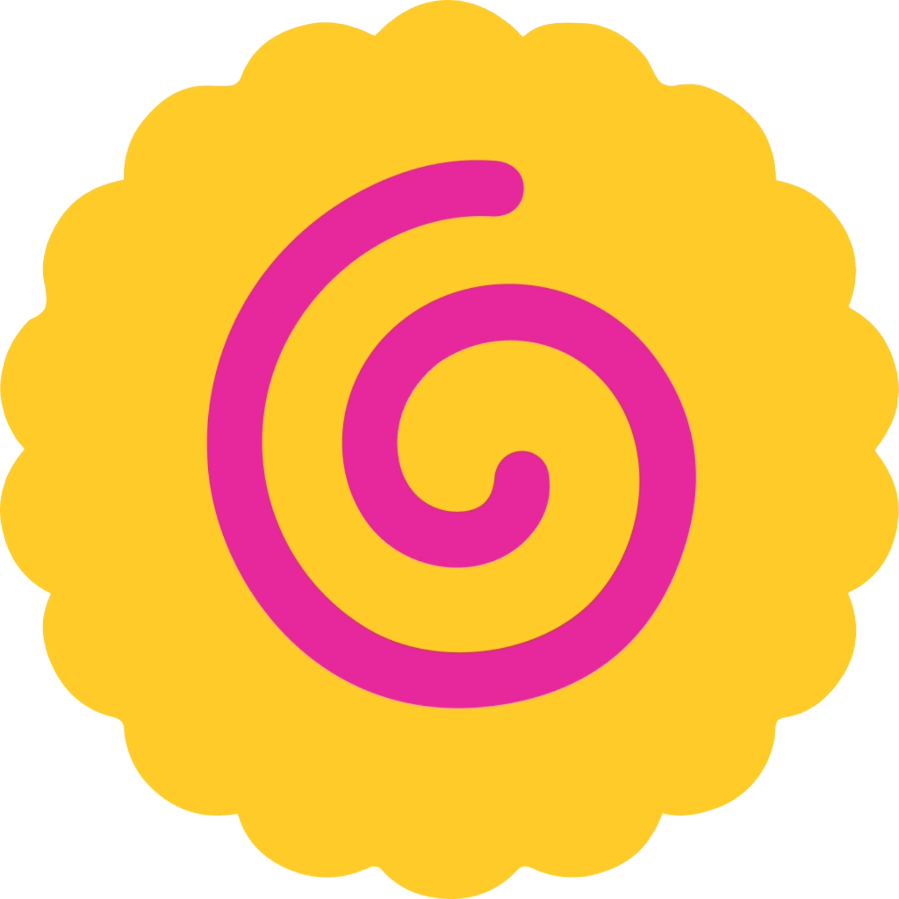

<div align="center">



# Fishcake Universal Deck

### **The Official Presentation for Fishcake EventFi**

Leading Real-World Web3 Solutions (RWS) — Make Token Value Real

[](https://universaldeck.fishcake.org)
[](https://universal-fishcake-deck.vercel.app)
[](https://github.com/FishcakeLab/Universal-Fishcake-Deck/actions)

</div>

---

## What is Fishcake?

**Fishcake** is the execution layer for Real-World Solutions (RWS) in marketing. It powers incentive-driven, on-chain marketing built for real-world engagement — connecting merchants and users through tokenized events, transparent rewards, and a self-sustaining ecosystem.

> *"Everyone talks about Real-World Web3. Fishcake executes it."*

---

## Slide Deck

18 slides covering the complete Fishcake story:

| # | Slide | Description |
|---|---|---|
| 1 | **Title** | Fishcake EventFi — Leading RWS |
| 2 | **Opening Claim** | Tokenizing Real-life Interactions / Engagements |
| 3 | **The Decade-Long Detour** | Beyond Financial Tools — ICO, DeFi, NFT, Metaverse, DePIN, RWA |
| 4 | **RWA vs. RWS** | From Assets to Solutions |
| 5 | **On-Chain Everything** | Why RWS is the path to get there |
| 6 | **The $500B Problem** | Where marketing spend actually goes |
| 7 | **What Fishcake Is** | Four Non-Negotiable On-Chain Principles |
| 8 | **The Gravity Loop** | Self-sustaining merchant-user flywheel |
| 9 | **Marketing Math** | Fishcake model vs. traditional — $10,000 + FCC rewards |
| 10 | **Loyalty Without Baggage** | Fishcake Loyalty Ecosystem |
| 11 | **For Users** | Web3 that doesn't feel like Web3, BUT rewarding |
| 12 | **Fishcake Coin (FCC)** | A stock-like on-chain asset — claim on Fishcake's growth |
| 13 | **Featured Tokenomics** | Redemption Pool + PoW Mining |
| 14 | **Token Distribution** | Rewarding builders, not speculators |
| 15 | **Where We Are** | Live infrastructure — scaling multi-chain |
| 16 | **Why Fishcake Wins** | Vision → RWS → Utility → Ecosystem → Tokenomics → Community |
| 17 | **The Close** | Fishcake — Where Everyday Life Meets Web3 |
| 18 | **Final Frame** | Download the app, connect with us |

---

## Tech Stack

| Layer | Technology |
|---|---|
| Framework | React 18 · TypeScript |
| Build | Vite 5 |
| Styling | Tailwind CSS · shadcn/ui |
| Fonts | Inter · Space Grotesk · JetBrains Mono (self-hosted via @fontsource) |
| Icons | Lucide React |
| PDF Export | Puppeteer (headless Chrome) · pdf-lib |
| Deployment | Vercel (auto-deploy via GitHub Actions) |

---

## Project Structure

```
├── public/                          # Static assets
│   ├── Fishcake_Universal_Deck.pdf  # Pre-generated high-quality PDF (30-40 MB)
│   └── fishcake-icon.png
├── docs/                            # Content & documentation
│   └── slide-contents.md            # Full slide text content
├── scripts/
│   └── generate-pdf.mjs             # Puppeteer PDF generator (3x retina)
├── src/
│   ├── main.tsx                     # Entry point + font imports
│   ├── App.tsx                      # Router shell
│   ├── index.css                    # Design system (CSS variables, animations)
│   ├── assets/                      # Logos
│   ├── components/
│   │   ├── presentation/            # Deck framework (navigation, export, layout)
│   │   │   ├── ExportMenu.tsx       # PDF download button + overlay animation
│   │   │   ├── SlideNavigation.tsx  # Prev/Next arrows + slide counter
│   │   │   ├── NavigationDots.tsx   # Bottom dot indicators
│   │   │   ├── SlideContainer.tsx   # Slide wrapper w/ gradient background
│   │   │   ├── SlideTitle.tsx       # Reusable slide header
│   │   │   ├── SlideCard.tsx        # Glass-morphism content card
│   │   │   ├── SlideTable.tsx       # Styled data table
│   │   │   ├── SlideList.tsx        # Bullet-point list
│   │   │   ├── AnimatedBackground.tsx
│   │   │   ├── FloatingElements.tsx
│   │   │   ├── GeometricShapes.tsx
│   │   │   ├── GravityLoop.tsx
│   │   │   └── GridBackground.tsx
│   │   ├── slides/                  # Individual slide components (01-21)
│   │   │   ├── Slide01TitleSlide.tsx
│   │   │   ├── ...
│   │   │   └── Slide21Final.tsx
│   │   └── ui/                      # shadcn/ui primitives (button, toast, tooltip)
│   ├── hooks/                       # use-mobile, use-toast
│   ├── lib/                         # utils (cn helper)
│   └── pages/
│       ├── Index.tsx                # Main presentation page (slide state, keyboard nav)
│       └── NotFound.tsx
├── .github/workflows/deploy.yml     # CI/CD pipeline
├── index.html                       # HTML shell
├── vite.config.ts
├── tailwind.config.ts
├── tsconfig.json
└── package.json
```

---

## Getting Started

```bash
git clone https://github.com/FishcakeLab/Universal-Fishcake-Deck.git
cd Universal-Fishcake-Deck
npm install
npm run dev
```

### Generate PDF

```bash
npm run generate:pdf    # Captures all 18 slides via headless Chrome → PDF
```

### Build

```bash
npm run build           # Production build (Vite)
```

---

## Deployment

Every push to `main` triggers automatic deployment:

```
Push → GitHub Actions → npm ci → vercel build → vercel deploy --prod
```

Live at **[universaldeck.fishcake.org](https://universaldeck.fishcake.org)**

---

## Links

| | |
|---|---|
| 🌐 **Website** | [fishcake.org](https://fishcake.org) |
| 📱 **App** | [fishcake.io](https://fishcake.io) |
| 🎤 **Deck** | [universaldeck.fishcake.org](https://universaldeck.fishcake.org) |
| 𝕏 **Twitter** | [@fishcake_labs](https://x.com/fishcake_labs) |
| ✈️ **Telegram** | [Fishcake_Labs](https://t.me/Fishcake_Labs) |
| 💻 **GitHub** | [FishcakeLab](https://github.com/FishcakeLab) |

---

<div align="center">

**© 2026 Fishcake. All rights reserved.**

*Fishcake — Where Everyday Life Meets Web3.*

</div>
